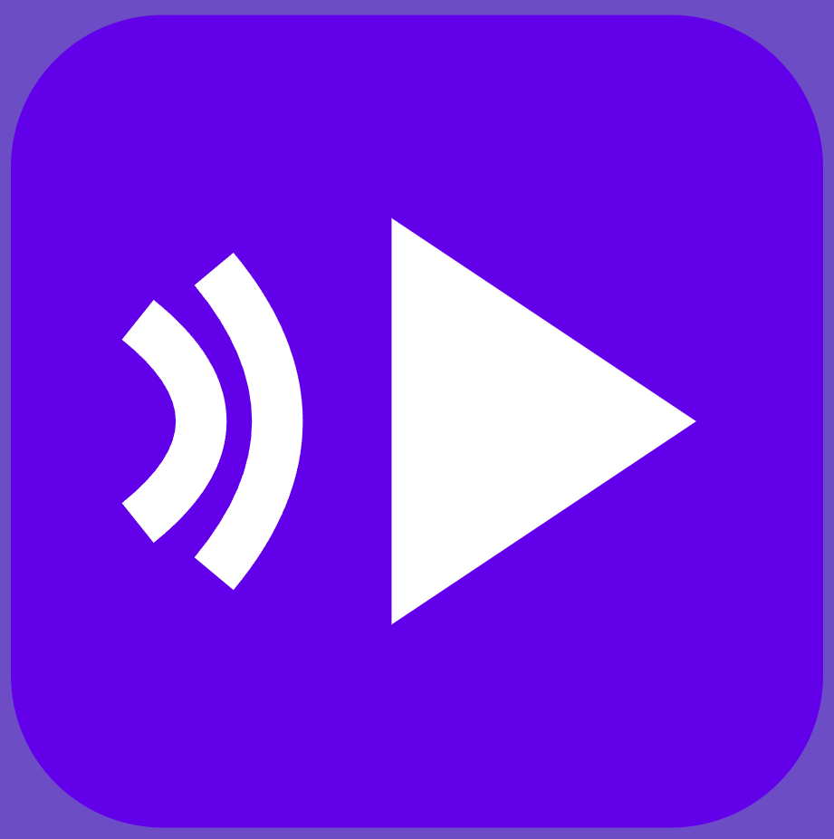
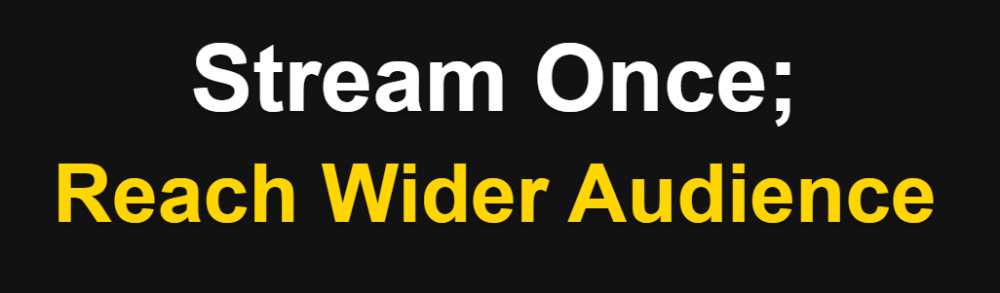

#  BetterStream

### [🔗 Visit BetterStream.io](https://betterstream.io)

## 🚀 What is BetterStream?

BetterStream is a free cloud-based service that simplifies multi-platform streaming for content creators. Say goodbye to complex configurations and expensive solutions – stream to multiple platforms simultaneously with just one stream key!

## ✨ Core Features

- **Multi-Stream Magic**: Stream simultaneously to 4+ platforms with a single key
- **Platform Support**: Twitch, YouTube, Aparat, Kick, Rumble
- **Completely Free**: No credit card required
- **No Watermark**: Pure, unaltered streams without any additional branding
- **Full Control**: Easily manage, modify, or delete your stream keys anytime
- **Safe & Secure**: Your stream keys are protected

## 🛠️ How It Works

1. Sign up on BetterStream (no registration required)
2. Enter your stream keys for your desired platforms
3. Receive your unified multi-stream key
4. Use the key with OBS or your preferred streaming software
5. Start streaming to multiple platforms at once!

## 🤝 Support

### Discord Server
Join our vibrant Discord community for latest announcements, bug reports, feature requests, community discussions:

### Email Support
For direct assistance, reach out to us at:
- 📧 support@betterstream.io

## 🔧 Technical Requirements

- Compatible with OBS Studio
- Stable internet connection (same as the requirement for a single stream, i.e., at least 6 Mbps upload speed for 1080p multi-stream, )
- Valid stream keys for your target platforms

## 💡 About Us

BetterStream was launched in September 2024 with a clear mission: democratizing multi-platform streaming for content creators. We believe that reaching a wider audience should not be complicated or expensive. Our cloud-powered solution enables creators to focus on what truly matters – creating great content.

---

[Website](https://betterstream.io) • [FAQ](https://betterstream.io/faq)

